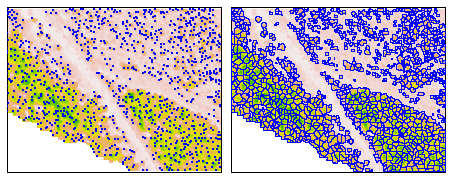
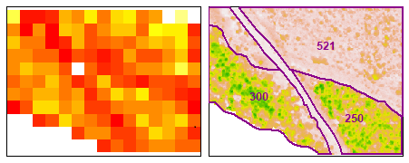

<!-- README.md is generated from README.Rmd. Please edit that file -->

## ForestTools: Tools for analyzing remotely sensed forest data

**Authors:** Andrew Plowright  **License:** GPL 3

The ForestTools R package offers functions to analyze remotely sensed forest data.

### Detect and segment trees

Individual trees can be detected and delineated using a combination of the
**variable window filter**  (`vwf`) and **marker-controlled segmentation**
(`mcws`) algorithms, both of which are applied to a rasterized **canopy height model (CHM)**.
CHMs are typically derived from aerial LiDAR or photogrammetric point clouds.

### Compute textural metrics

**Grey-level co-occurrence matrices** (GLCMs) and their associated statistics can be computed for individual trees using a single-band
image and a segment raster (which can be produced using `mcws`). These metrics can be used to characterize and classify trees.

### Summarize forest information

The height and count of treetops can be summarized within a grid or within user-defined geographical areas using `sp_summarise`.

### References

This library implements techniques developed in the following studies:

* **Variable window filter**: [Seeing the trees in the forest](https://www.ingentaconnect.com/content/asprs/pers/2004/00000070/00000005/art00003) by Popescu, S. C., & Wynne, R. H. (2004)
* **Marker-controlled segmentation**: [Morphological segmentation](https://www.sciencedirect.com/science/article/pii/104732039090014M) by Meyer, F., & Beucher, S. (1990)
* **Grey-level co-occurrence matrices**: [Robust radiomics feature quantification using semiautomatic volumetric segmentation](https://journals.plos.org/plosone/article?id=10.1371/journal.pone.0102107) by Parmar, C., Velazquez, E.R., Leijenaar, R., Jermoumi, M., Carvalho, S., Mak, R.H., Mitra, S., Shankar, B.U., Kikinis, R., Haibe-Kains, B. and Lambin, P. (2014)

### Research

The following is a non-exhaustive list of research papers that use the ForestTools library. Several of these studies discuss topics such as algorithm parameterization, and may be informative for users of this library.

* [Potential for Individual Tree Monitoring in Ponderosa Pine-Dominated Forests Using Unmanned Aerial System Structure from Motion Point Clouds](https://cdnsciencepub.com/doi/abs/10.1139/cjfr-2020-0433) by Creasy, M. B., Tinkham, W. T., Hoffman, C. M., & Vogeler, J. C. (2021)

* [Assessment of Above-Ground Carbon Storage by Urban Trees Using LiDAR Data: The Case of a University Campus](https://www.mdpi.com/1999-4907/12/1/62) by Gülçin, D., & van den Bosch, C. C. K. (2021)

* [Influence of Agisoft Metashape Parameters on UAS Structure from Motion Individual Tree Detection from Canopy Height Models](https://www.mdpi.com/1999-4907/12/2/250) by Tinkham, W. T., & Swayze, N. C. (2021)

* [Ground-penetrating Radar as Phenotyping Tool for Characterizing Intraspecific Variability in Root Traits of Pinus Halepensis](https://www.researchsquare.com/article/rs-161358/latest.pdf) by Lombardi, E., Ferrio, J. P., Rodríguez-Robles, U., de Dios, V. R., & Voltas, J. (2021)

* [Bridging the genotype–phenotype gap for a Mediterranean pine by semi‐automatic crown identification and multispectral imagery](https://nph.onlinelibrary.wiley.com/doi/abs/10.1111/nph.16862) by Santini, F., Kefauver, S. C., Araus, J. L., Resco de Dios, V., Martín García, S., Grivet, D., & Voltas, J. (2021)

* [Tracking the rates and mechanisms of canopy damage and recovery following Hurricane Maria using multitemporal lidar data](https://www.biorxiv.org/content/10.1101/2021.03.26.436869v1.abstract) by Leitold, V., Morton, D. C., Martinuzzi, S., Paynter, I., Uriarte, M., Keller, M., ... & González, G. (2021)

* [Cross-scale interaction of host tree size and climatic water deficit governs bark beetle-induced tree mortality](https://www.nature.com/articles/s41467-020-20455-y) by Koontz, M. J., Latimer, A. M., Mortenson, L. A., Fettig, C. J., & North, M. P. (2021)

* [The wildlife‐livestock interface on extensive free‐ranging pig farms in central Spain during the “montanera” period](https://onlinelibrary.wiley.com/doi/abs/10.1111/tbed.13854) by Triguero‐Ocaña, R., Laguna, E., Jiménez‐Ruiz, S., Fernández‐López, J., García‐Bocanegra, I., Barasona, J. Á., ... & Acevedo, P. (2020)

* [Supporting Assessment of Forest Burned Areas by Aerial Photogrammetry: The Susa Valley (NW Italy) Fires of Autumn 2017](https://www.ncbi.nlm.nih.gov/pmc/articles/PMC7974678/) by De Petris, S., Momo, E. J., & Borgogno-Mondino, E. (2020)

* [Applying unmanned aerial vehicles (UAVs) to map shrubland structural attributes in northern Patagonia, Argentina](https://cdnsciencepub.com/doi/abs/10.1139/cjfr-2019-0440@cjfrjuvs-uav.issue1) by Gonzalez Musso, R. F., Oddi, F. J., Goldenberg, M. G., & Garibaldi, L. A. (2020)

* [Automated Canopy Delineation and Size Metrics Extraction for Strawberry Dry Weight Modeling Using Raster Analysis of High-Resolution Imagery](https://www.mdpi.com/2072-4292/12/21/3632) by Abd-Elrahman, A., Guan, Z., Dalid, C., Whitaker, V., Britt, K., Wilkinson, B., & Gonzalez, A. (2020)

* [Northern Bobwhite Non‐Breeding Habitat Selection in a Longleaf Pine Woodland](https://wildlife.onlinelibrary.wiley.com/doi/abs/10.1002/jwmg.21925) by Kroeger, A. J., DePerno, C. S., Harper, C. A., Rosche, S. B., & Moorman, C. E. (2020)

* [Evaluation of Features Derived from High-Resolution Multispectral Imagery and LiDAR Data for Object-Based Support Vector Machine Classification of Tree Species](https://www.tandfonline.com/doi/abs/10.1080/07038992.2020.1809363) by Roffey, M., & Wang, J. (2020)

* [Mapping Species at an Individual-Tree Scale in a Temperate Forest, Using Sentinel-2 Images, Airborne Laser Scanning Data, and Random Forest Classification](https://www.mdpi.com/2072-4292/12/22/3710) by Plakman, V., Janssen, T., Brouwer, N., & Veraverbeke, S. (2020)

* [High-resolution multisensor remote sensing to support date palm farm management](https://www.mdpi.com/2077-0472/9/2/26) by Mulley, M., Kooistra, L., & Bierens, L. (2019)

* [Quantifying canopy tree loss and gap recovery in tropical forests under low-intensity logging using VHR satellite imagery and airborne LiDAR](https://www.mdpi.com/2072-4292/11/7/817) by Dalagnol, R., Phillips, O. L., Gloor, E., Galvão, L. S., Wagner, F. H., Locks, C. J., & Aragão, L. E. (2019)

* [Forest inventory sensitivity to UAS-based image processing algorithms](https://afrjournal.org/index.php/afr/article/download/1282/818) by Maturbongs, B., Wing, M. G., Strimbu, B., & Burnett, J. (2019)

* [Remote sensing pipeline for tree segmentation and classification in a mixed softwood and hardwood system](https://peerj.com/articles/5837/) by McMahon, C. A. (2019)

* [Tree height in tropical forest as measured by different ground, proximal, and remote sensing instruments, and impacts on above ground biomass estimates](https://www.sciencedirect.com/science/article/abs/pii/S0303243419300844) by Laurin, G. V., Ding, J., Disney, M., Bartholomeus, H., Herold, M., Papale, D., & Valentini, R. (2019)

* [Advances in the Derivation of Northeast Siberian Forest Metrics Using High-Resolution UAV-Based Photogrammetric Point Clouds](https://www.mdpi.com/2072-4292/11/12/1447) by Brieger, F., Herzschuh, U., Pestryakova, L. A., Bookhagen, B., Zakharov, E. S., & Kruse, S. (2019)

* [Multi-scale Assessment of Northern Bobwhite and White-tailed Deer Habitat Selection in Longleaf Pine Woodlands](https://repository.lib.ncsu.edu/bitstream/handle/1840.20/37046/etd.pdf?sequence=1) by Kroeger, A. J. (2019)

* [Bayesian and classical machine learning methods: a comparison for tree species classification with LiDAR waveform signatures](https://www.mdpi.com/2072-4292/10/1/39) by Zhou, T., Popescu, S. C., Lawing, A. M., Eriksson, M., Strimbu, B. M., & Bürkner, P. C. (2018)

* [Underproductive agriculture aids connectivity in tropical forests](https://www.sciencedirect.com/science/article/abs/pii/S0378112717308101) by Evans, L. J., Goossens, B., & Asner, G. P. (2017)
